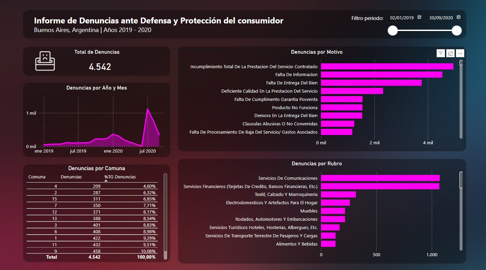

# Repositorio de Dashboards desarrollados en Power BI

Este repositorio tiene como objetivo recopilar diferentes tableros desarrollados en `Power BI`.

## Organización del proyecto

### Directorio *data*

Contiene en archivos *CSV* los dataset utilizados para la construcción de los tableros.

### Directorio del Dashboard

Contiene los archivos relacionados con el tablero desarrollado en `Power BI`. Dicha carpeta contiene un archivo `README.md` con el resumen del dashboard relacionado.

## Proyectos desarrollados

### Tablero de denuncias 

Denuncias ante Defensa y Protección del consumidor hechas en Buenos Aires (Argentina) entre los años 2019 y 2020.

